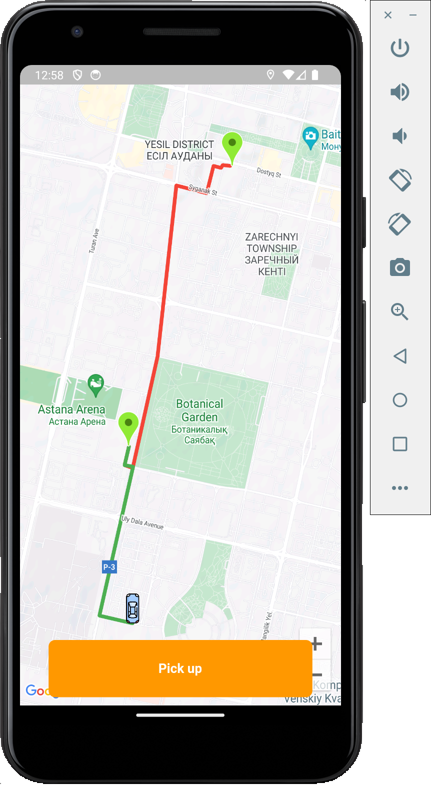
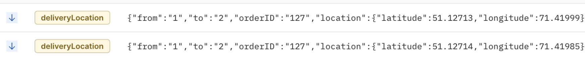
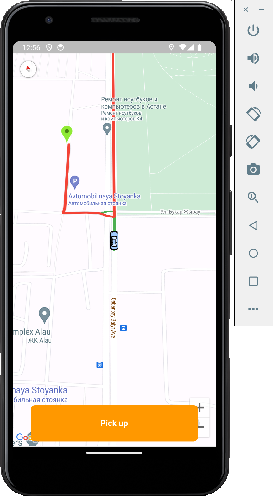
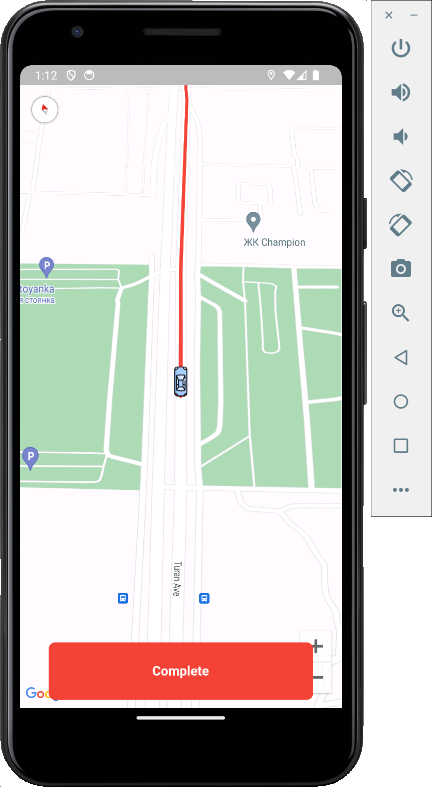
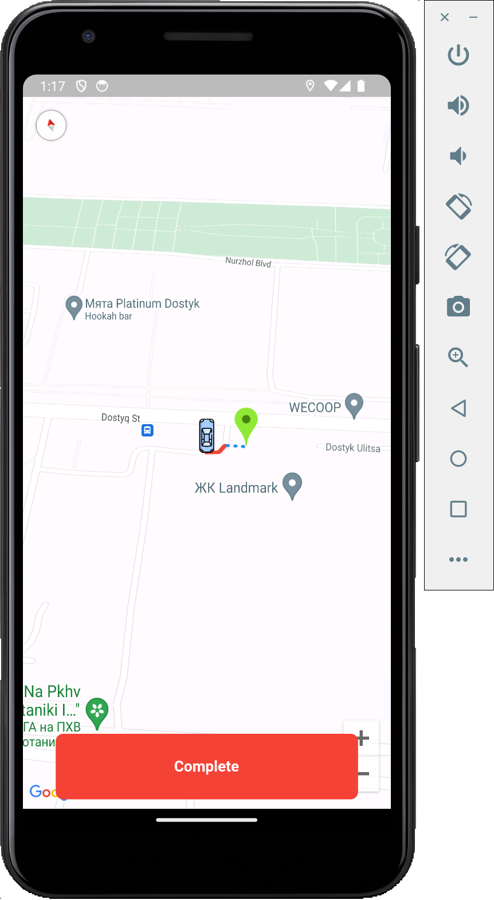
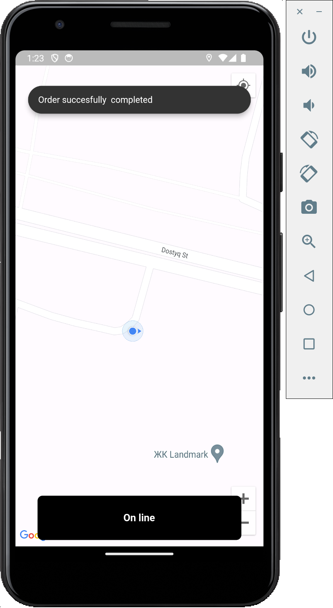

## Flutter delivery
- Flutter delivery app with functionalities such as search for delivery, place an order, google maps integration, cost efficiency using of directions api  , real time polyline updates, socket io realtime location exchanges.
- Clean architecture and BloC used to manage app's business logic.
## App features
1- Authentication and Authorization.
 
2- find an order
 
3- pick an order
 
4- complete an order
 
5- Real time location
 
6- Building a route to a particular location
 
7- Smooth polyline animation

### Packages used:
  - google_maps_flutter
  - flutter_polyline_points
  - flutter_bloc
  - location
  - maps_toolkit
  - equatable
  - dio
  - get_it
  - shared_preferences
  - geolocator:
  - socket_io_client: 

### To run the project
1- Download delivery_service project from my repository
2- run that backend 
<code>go build</code> this is for golang services
<code>npx nodemon</code>  this is for node js service

<code> flutter pub get</code>
 
<code> flutter run</code>

## Screenshots 
- here postman is presented as a customer 
- first you need to sign in as a customer , (customer sign in is not implemented I will implement that soon)
  
- set header for the token in socket io tester
  
- send order-event to find delivery person
  
- sample order json
  <code>
  {
    "order" : {
      "destination": {
            "latitude" :51.12715100639213, 
            "longitude": 71.42031420048505
      },
      "origin": {
            "latitude" :51.104357, 
            "longitude": 71.4068894
      },
      "destinationAddress": "sadqwdqd",
      "originAddress": "dwqdqd",
      "customerId": 2
    }
}
  </code>

- delivery app
- first you need to sign in as a Delivery person
- after signing in you are directed to maps

- press the button online to start searching nearest order
- when order is found you see the directions to pick up and drop off points, press the green button Start
- and the button gets orange with the text Pick Up

- each time you move, customer receives your location in real time.

- getting closer

- after you picked the order second polyline (first green polyline is the destination where you pick up the order, second red polyline is the destination where you need to deliver the order) is only shown.

- Complete order

## For contact
https://www.linkedin.com/in/samat-serikov-34a92923a/
 
abzalovichsamat@gmail.com